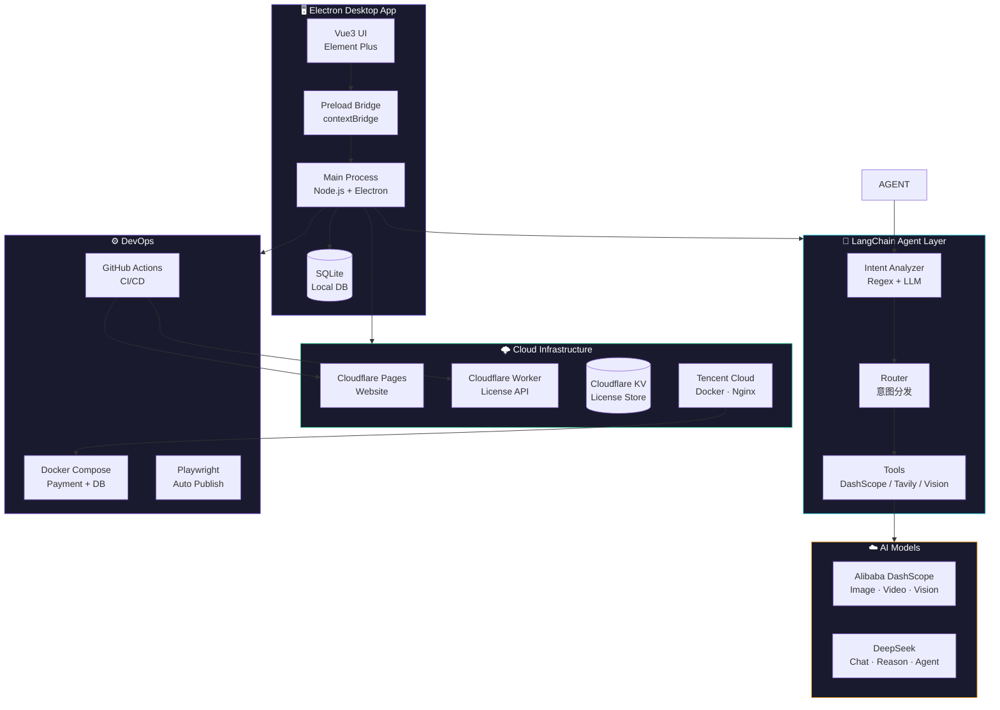
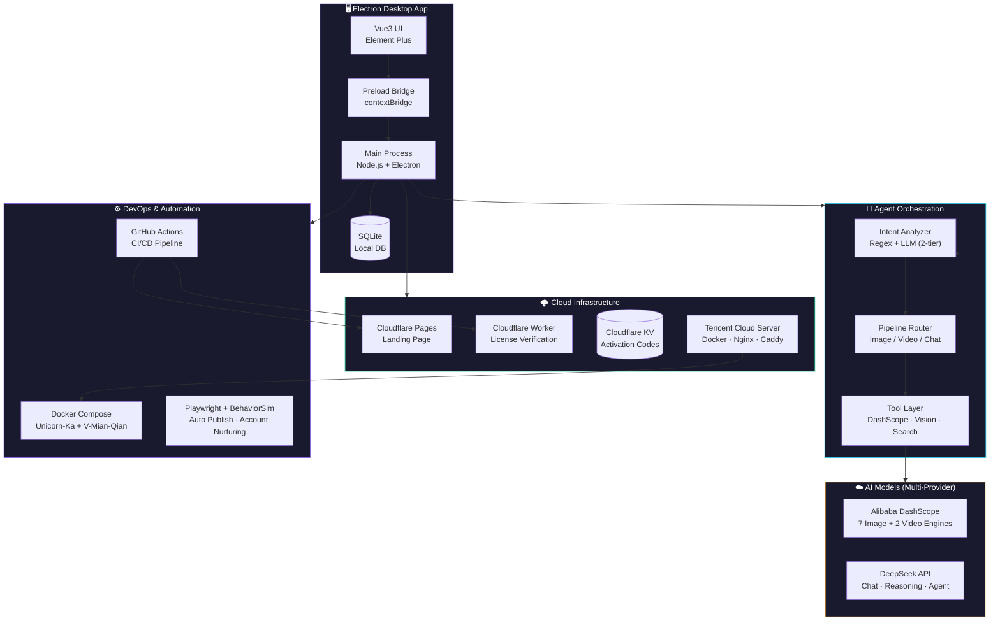

# 🐝 Liang Tengbiao (梁腾彪)

### AI Application Developer · Full-Stack Engineer

Creator of **Little Bee V2** — AI-Powered Content Creation Suite | 2026 Graduate

---

🇨🇳 中文版

## 🚀 Little Bee V2 — AI 创作桌面工具

> 面向内容创作者的 AI 桌面应用，集成多模态大模型，实现图片生成、视频创作、智能助手、多平台自动发布。独立完成从技术选型到商业运营的全链路开发。

**[🌐 访问官网 →](http://www.newlbee.xyz)**

### 系统架构

### ✨ 核心功能

| 模块 | 技术实现 | 说明 |
|------|---------|------|
| 🎨 **AI 多模态创作** | DashScope API (7 种图片模型 + 视频生成) | wan/qwen/z-image 系列，最高 4K 分辨率；通义万相 + HappyHorse 双视频引擎；Qwen3.7 VL 图片/视频理解 + 提示词反推 |
| 🤖 **Agent 智能编排** | LangChain + 自建双层意图路由 | 正则快速匹配（毫秒级）+ LLM 语义分析（DeepSeek），自然语言触发分镜 → 视频合成全自动流水线 |
| 📤 **多平台自动发布** | Playwright + BehaviorSim | 支持抖音/快手/B站，Chrome DevTools 定位 + 模拟真人操作节奏（随机延迟/变速滚动/逐字输入），规避风控 |
| 🔐 **一机一码授权** | SHA-256 硬件指纹 + HMAC 签名 | MAC+CPU+磁盘序列号，4 层存储交叉验证（文件/备份/tmpdir/注册表），Cloudflare Worker 远程核销，一码一次防重复 |
| 🏗️ **全栈部署** | Cloudflare Pages + Workers/KV + Docker | 前端静态托管 + 后端 Serverless + 腾讯云 Docker 支付系统 + GitHub Actions CI/CD |
| 🛒 **商业运营** | 独角数卡 + V免签（云免签） | 支付宝/微信全自动收款 → 核销 → 发货，买断制定价（标准版 168 / Pro版 268 / 周卡 19） |

### 💼 实习经历

- **豆神教育**（2025.10 - 2026.01）— **AI Prompt 实习生**：纯 Prompt 驱动 AI 完成英语教学课件与互动游戏开发，支持 iOS/iPad 多端运行
- **绿雪智能**（2025.05 - 2025.10）— **前端开发实习生**：负责 AI 自媒体系统的前后端开发，实现知乎/头条/微博等多平台绑定与自动化发布

### 🛠 技术栈

`TypeScript` `Vue3` `Electron` `Node.js` `LangChain` `Cloudflare Workers` `Docker` `Playwright` `PostgreSQL` `MySQL` `Redis` `GitHub Actions` `MCP` `Prompt Engineering`

### 📍 求职意向

- 🎓 洛阳师范学院 · 软件工程 · 2026 届本科
- 📍 期望城市：**北京**
- 💡 方向：**AI 应用开发 / 全栈工程师 / 前端开发**
- 💰 期望薪资：10-15K（可谈）

---

## 🚀 Little Bee V2 — AI Content Creation Suite

> A desktop AI application for content creators. Integrates multimodal LLMs (text→image, text→video, vision understanding) with Agent orchestration, multi-platform auto-publishing, and a hardware-bound licensing system.
> Built from scratch — architecture, development, deployment, and monetization — by a solo developer.

**[🌐 Official Website →](http://www.newlbee.xyz)** &nbsp;|&nbsp; **[⬇️ Download](http://www.newlbee.xyz)**

### System Architecture

### ✨ Core Features

| Module | Stack | Highlights |
|--------|-------|------------|
| 🎨 **Multimodal AI** | Alibaba DashScope | 7 image models (wan/qwen/z-image, up to 4K), 2 video engines (wanx + HappyHorse), Qwen3.7 VL vision (analyze + reverse-engineer prompts) |
| 🤖 **Agent Orchestration** | LangChain + Custom Router | Two-tier intent detection (regex fast-path + LLM semantic), auto-routes to multi-step pipelines (script → storyboard → video synthesis) |
| 📤 **Auto Publishing** | Playwright + BehaviorSim | Douyin / Kuaishou / Bilibili. Human-like behavior simulation (random delays, variable-speed scroll, character-by-character typing) to bypass anti-bot detection |
| 🔐 **License System** | SHA-256 HW Fingerprint + HMAC | MAC + CPU + Disk serial → hardware ID. 4-layer storage cross-validation (file/backup/tmpdir/registry). Cloudflare Worker remote verification. One code, one machine. |
| 🏗️ **Full-Stack DevOps** | CF Pages/Workers/KV + Docker | Static frontend + Serverless backend + Docker containers on Tencent Cloud + GitHub Actions CI/CD |
| 🛒 **Monetization** | Self-hosted payment stack | Automated order → payment → license delivery via Unicorn-Ka + V-Mian-Qian (Alipay/WeChat). Buy-out pricing: Standard ¥168 / Pro ¥268 / Weekly ¥19 |

### 📸 Screenshots

<b>🖥️ AI Agent Chat</b>

<b>🎨 Image Generation</b>

<b>🎬 Video Creation</b>

<b>⚙️ Workflow Pipeline · Agent Orchestration</b>

<b>📤 Multi-Platform Publishing</b>

<b>🌐 Product Website</b>

<b>📋 Feature Overview</b>

### 💼 Internship Experience

- **Doushen Education** (Oct 2025 – Jan 2026) — **AI Prompt Engineer Intern**: Built English teaching courseware and interactive games entirely via prompt engineering. Deployed across iOS/iPad/Learning Machines.
- **Lvxue Intelligence** (May 2025 – Oct 2025) — **Frontend Developer Intern**: Developed an AI-powered self-media content system. Integrated LangChain with multiple LLM providers (DeepSeek/Qwen). Built cross-platform auto-publishing (Zhihu/Toutiao/Weibo) with Playwright.

### 🛠 Tech Stack

`TypeScript` `Vue3` `Electron` `Node.js` `LangChain` `Cloudflare Workers` `Docker` `Playwright` `PostgreSQL` `MySQL` `Redis` `GitHub Actions` `MCP` `Prompt Engineering`

### 🤝 About Me

- 🎓 B.E. in Software Engineering, Luoyang Normal University (2026)
- 🐝 Independently built & launched **Little Bee V2** — a commercial AI desktop product
- 📝 Tech blogger on [CSDN](https://blog.csdn.net/weixin_74225455) — multiple 1000+ read articles
- 📍 Seeking opportunities in **Beijing**
- 💡 Targeting: **AI Application Developer / Full-Stack Engineer / Frontend Developer**
- 💰 Expected salary: 10-15K CNY (negotiable)

---

**[🌐 Little Bee Website](http://www.newlbee.xyz)** &nbsp;·&nbsp; **[📝 CSDN Blog](https://blog.csdn.net/weixin_74225455)** &nbsp;·&nbsp; **[📧 Email](mailto:863193306@qq.com)**

*Built with ❤️ · Electron · Vue3 · LangChain · Claude Code*

