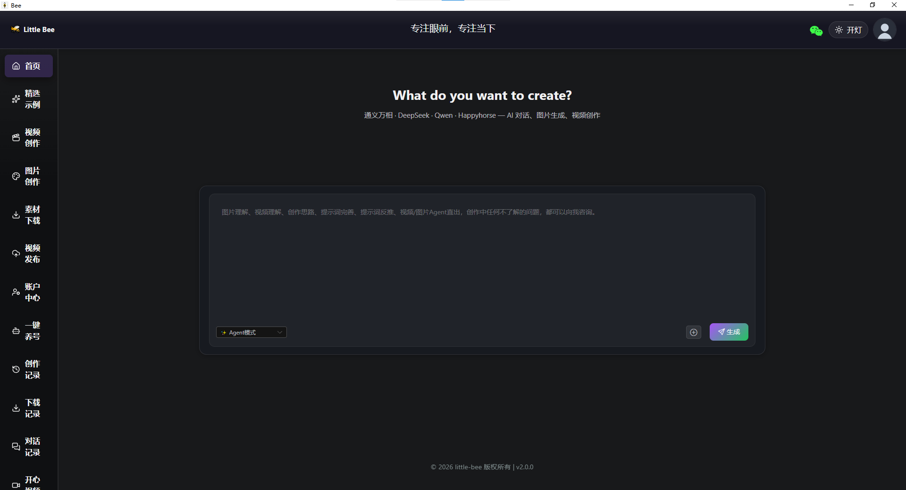
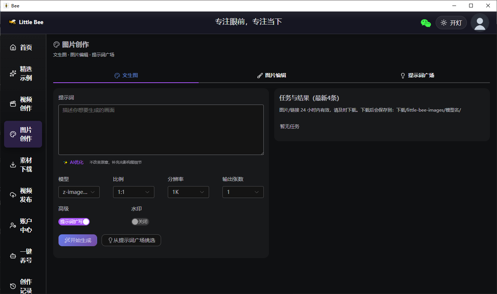
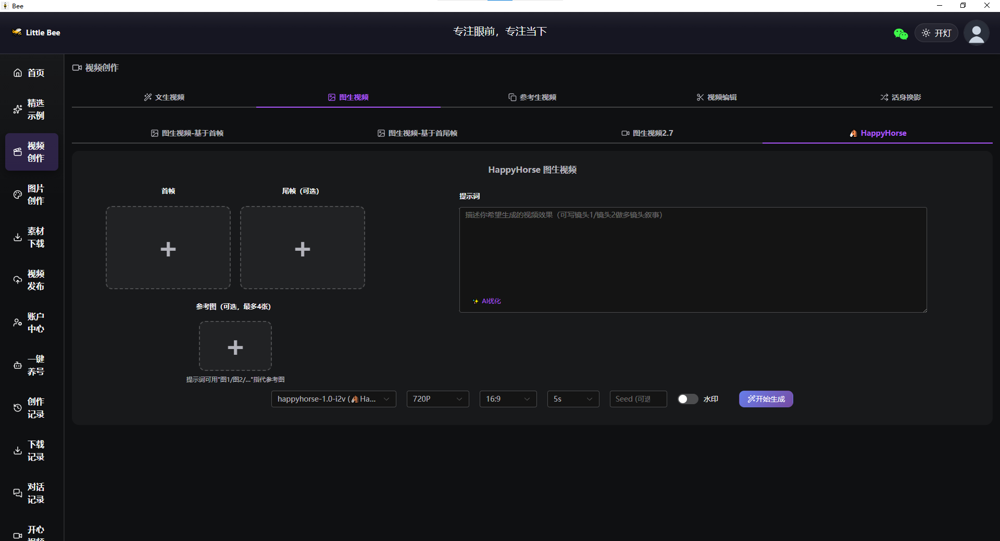
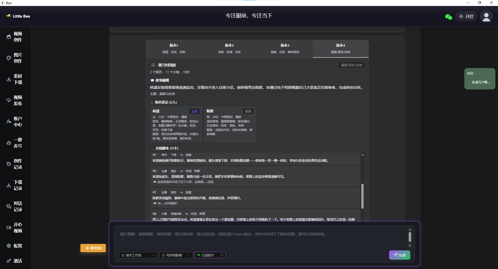
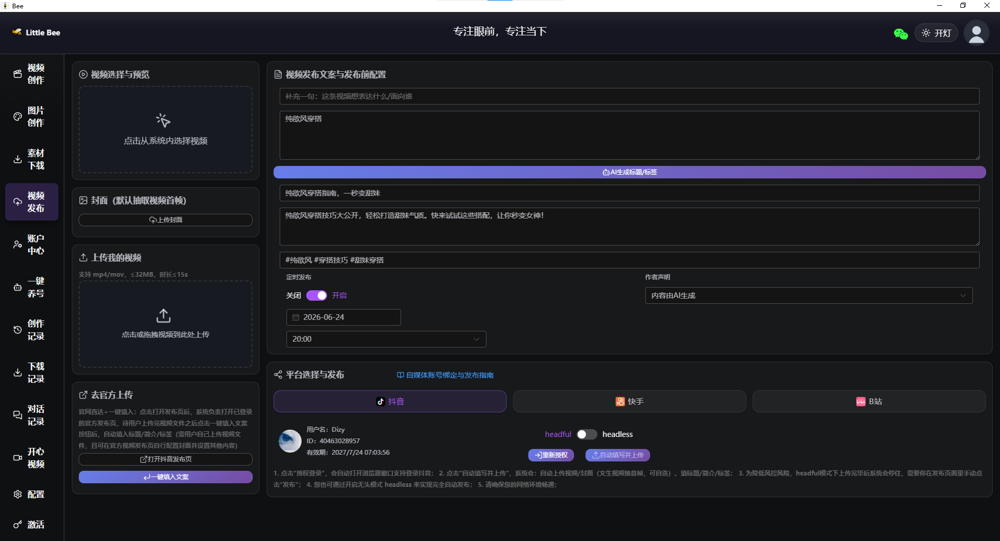
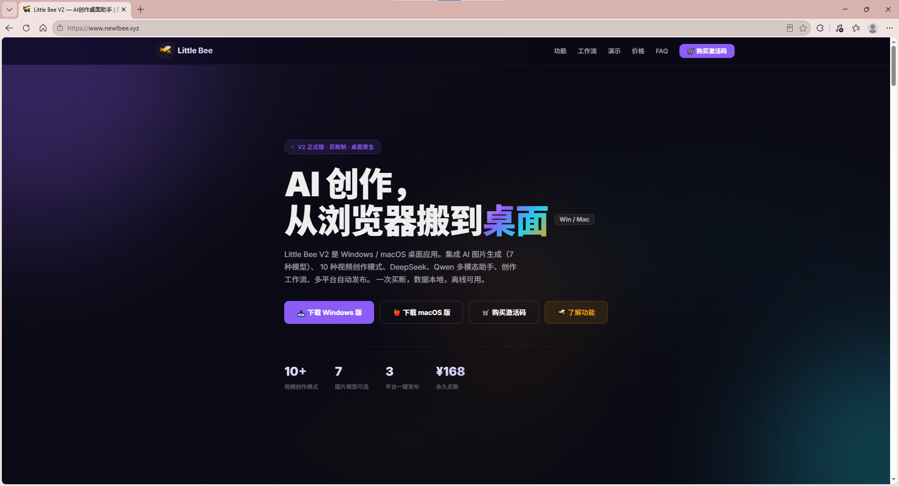
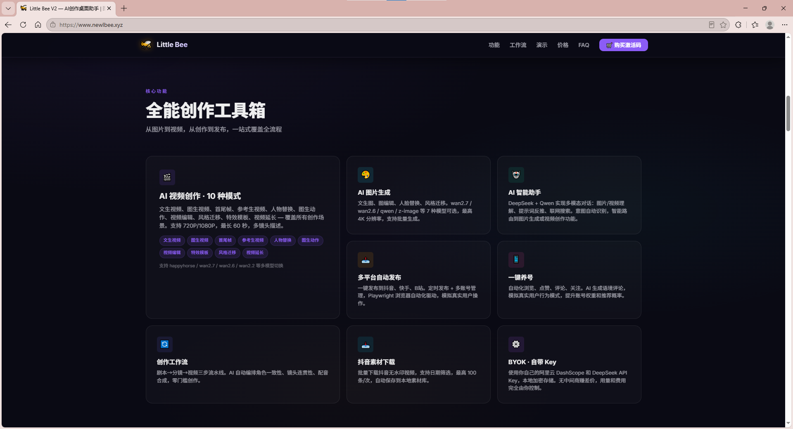

# 梁腾彪 | Tengbiao Liang

### AI 应用开发工程师 · 全栈方向

🐝 **Little Bee V2** 作者 | 2026 届应届生

---

## 🚀 Little Bee V2 — AI 创作桌面工具

> 一款面向内容创作者的 AI 桌面应用，集成多模态大模型，实现图片生成、视频创作、智能助手、多平台自动发布。
> 独立完成从技术选型、架构设计到部署上线的全链路开发，已上线商业运营。

**官网**：[http://www.newlbee.xyz](http://www.newlbee.xyz)

### ✨ 核心功能

| 功能 | 说明 |
|------|------|
| 🎨 **AI 多模态创作** | 接入阿里云 DashScope，支持图片生成（wan/qwen/z-image 系列 7 种模型，最高 4K）、视频生成（通义万相 wanx + HappyHorse）、多模态视觉理解（Qwen3.7 VL 图片/视频分析 + 提示词反推） |
| 🤖 **Agent 智能编排** | 基于 LangChain + Tool 机制，意图识别 → 自动路由 → 多步流水线，自然语言触发全自动化创作流程 |
| 📤 **多平台自动发布** | Playwright 驱动，支持抖音/快手/B站三大平台自动发布 + 养号，BehaviorSim 模拟真人操作规避风控 |
| 🔐 **一机一码授权** | 硬件指纹（MAC + CPU + 磁盘序列号 → SHA-256）、HMAC 签名防篡改、4 层存储交叉验证、Cloudflare Worker 远程核销 |
| 🏗️ **全栈部署** | Cloudflare Pages + Workers/KV + 腾讯云轻量服务器（宝塔 + Docker）+ GitHub Actions CI/CD |
| 🛒 **商业运营** | 独角数卡发卡 + V免签（PHP 云免签）全自动收款，买断制定价（标准版/Pro版/周卡）|

### 📸 产品截图

<b>🖥️ AI 智能助手 · Agent 对话</b>

<b>🎨 图片创作</b>

<b>🎬 视频创作</b>

<b>⚙️ 创作工作流 · Agent 编排</b>

<b>📤 多平台发布</b>

<b>🌐 产品官网</b>

<b>📋 系统模式介绍</b>

### 🛠 技术栈

`TypeScript` `Vue3` `Electron` `Node.js` `LangChain` `Cloudflare Workers` `Docker` `Playwright` `PostgreSQL` `MySQL` `Redis` `GitHub Actions`

---

## 💼 实习经历

- **豆神教育**（2025.10 - 2026.01）— AI Prompt 实习生，纯 Prompt 驱动 AI 完成英语课件与互动游戏开发
- **绿雪智能**（2025.05 - 2025.10）— 前端开发实习生，负责 AI 自媒体系统的前后端开发与多平台自动化发布

---

## 🤝 关于我

- 🎓 洛阳师范学院软件工程 2026 届本科应届生
- 🐝 独立开发并上线商业 AI 桌面应用 Little Bee V2
- 📝 热爱技术写作，CSDN 发布多篇原创文章
- 📍 期望工作城市：北京
- 💡 求职方向：AI 应用开发 / 全栈工程师 / 前端开发

---

**🔗 链接**

[🌐 Little Bee 官网](http://www.newlbee.xyz) · [📝 CSDN 技术博客](https://blog.csdn.net/weixin_74225455) · [📧 863193306@qq.com](mailto:863193306@qq.com)

